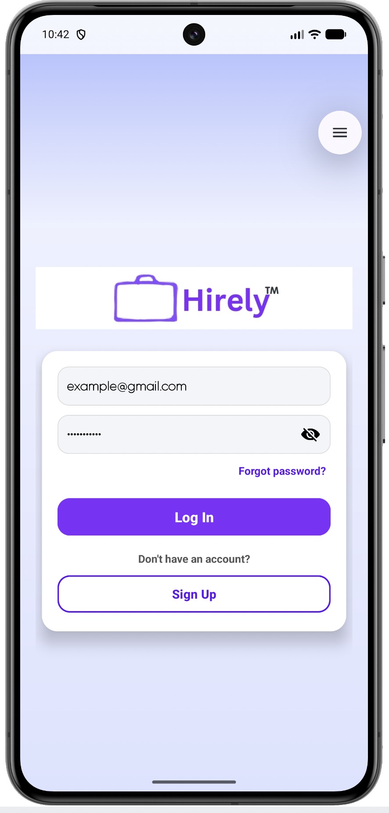
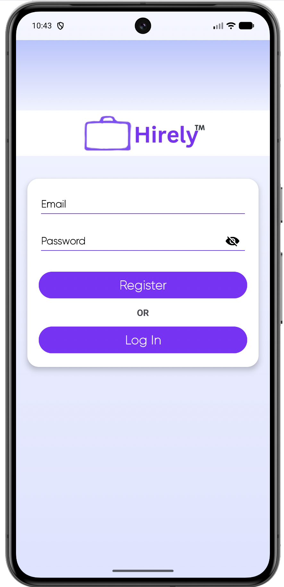
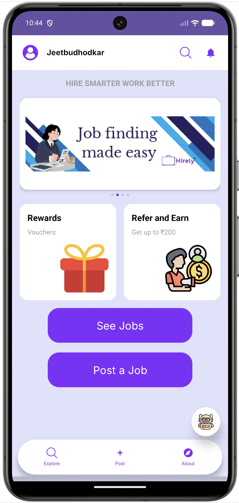
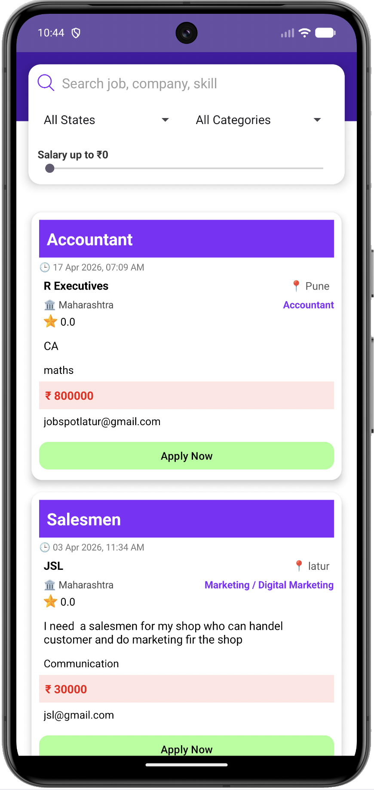
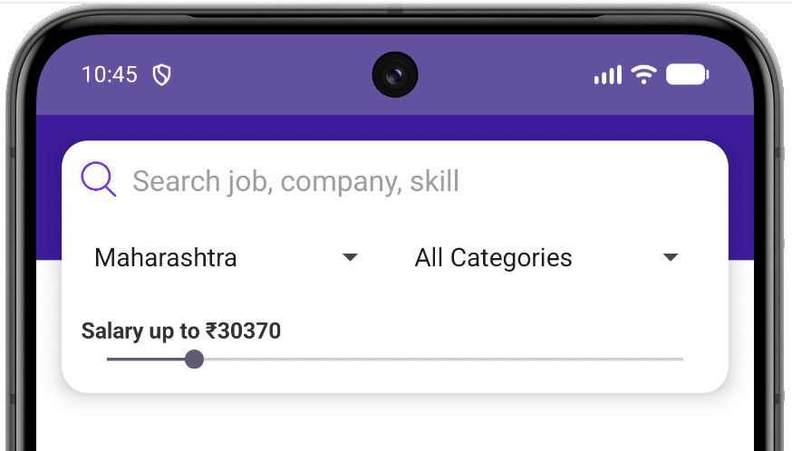
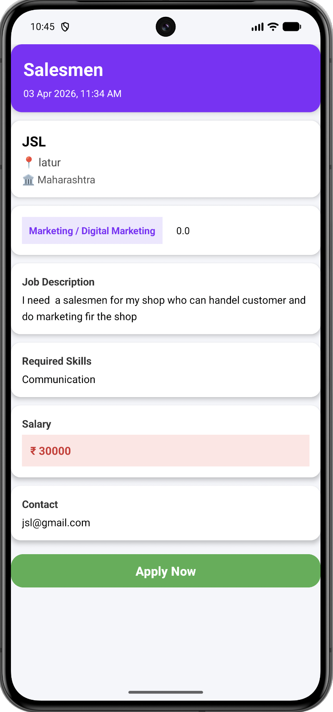
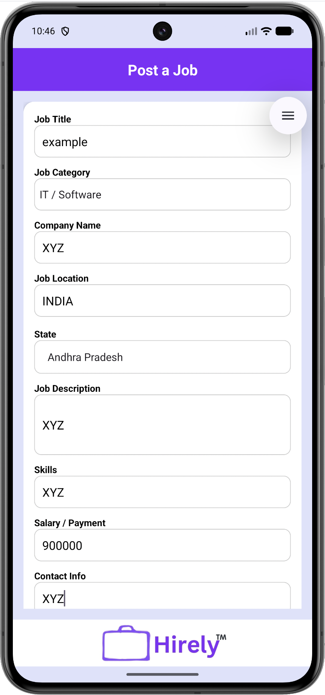
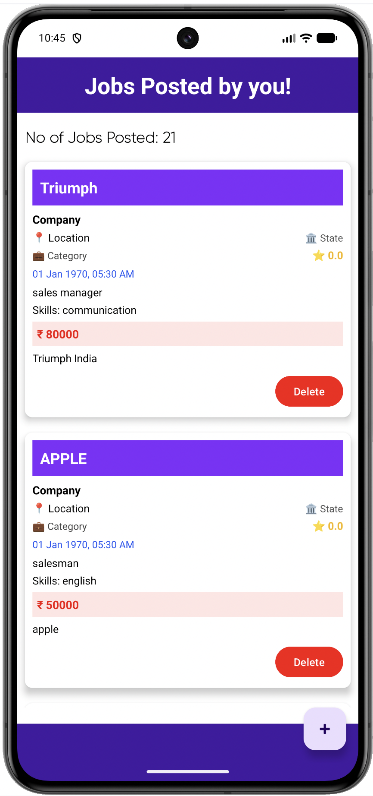
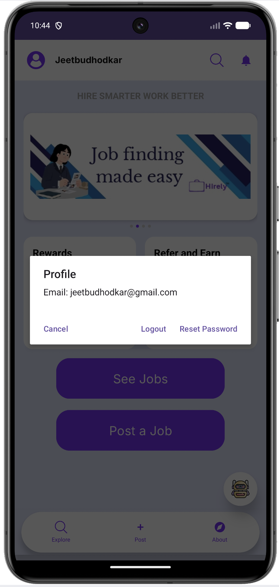

# 🚀 Hirely - Android Job Portal Application

<p align="center">
  
</p>

<h3 align="center"><b>Connecting Talent with Opportunity</b></h3>

<p align="center">
  
  
  
  
</p>

---

## 📖 About The Project

**Hirely** is a robust, modern Android-based Job Portal Application built to bridge the gap between job seekers and employers. Developed using **Java** and backed by **Firebase**, the application offers a seamless, real-time environment where users can effortlessly discover job openings, filter opportunities, publish new vacancies, and manage listings.

The platform focuses on streamlining the digital recruitment process, providing a smooth user experience for both applicants hunting for roles and recruiters managing active postings.

---
## 📥 Download Application

Get the latest stable release of the application directly below:

<p align="center">
  <a href="assets/hirely_V1.apk">
    
  </a>
</p>

> ℹ️ **Note:** Since this app is distributed as an independent APK file, you may need to enable *"Install from Unknown Sources"* in your Android security settings during installation.

---

## ✨ Key Features

### 👤 User Experience & Authentication
* **Secure Authentication:** Robust user onboarding and login powered by Firebase Authentication.
* **Dynamic Dashboard:** An interactive central hub for swift navigation across app modules.
* **Profile Management:** Personalized user profiles to maintain account details and session states.

### 🔍 Job Exploration & Filtering
* **Smart Search:** Instantly locate specific openings by filtering jobs by **Category** or **State**.
* **Salary Filtering:** Narrow down searches based on specific financial expectations.
* **Granular Insights:** Detailed job specification pages highlighting roles, required skills, and salaries.
* **Direct Application:** Quick-action options to apply instantly via secure email or direct contact details.

### 💼 Employer Features
* **Job Publishing:** Structured forms enabling employers to draft and publish new job vacancies seamlessly.
* **Listing Management:** Dedicated panel to view, update, or seamlessly delete active job posts.

---

## 🛠️ Tech Stack & Architecture

| Layer | Technology | Purpose |
| :--- | :--- | :--- |
| **Frontend** | Java / XML | Native Android development with clean, modular views |
| **UI Components** | Google Material Design | Responsive, modern, and highly accessible user layouts |
| **Database** | Firebase Realtime Database | Live data synchronization and persistent storage |
| **Auth Service** | Firebase Authentication | Secure credential management and session handling |
| **IDE** | Android Studio | Primary development and compilation environment |

---

# 📱 Application Walkthrough

<table align="center">
  <tr>
    <td align="center" width="33%"><b>🔐 Login Screen</b></td>
    <td align="center" width="33%"><b>📝 Registration</b></td>
    <td align="center" width="33%"><b>🏠 Home Dashboard</b></td>
  </tr>
  <tr>
    <td></td>
    <td></td>
    <td></td>
  </tr>
  <tr>
    <td valign="top">Secure login portal verifying credentials against Firebase auth.</td>
    <td valign="top">Quick multi-field account creation for new job seekers and recruiters.</td>
    <td valign="top">The central hub featuring categories, shortcuts, and quick navigation.</td>
  </tr>
</table>

<table align="center">
  <tr>
    <td align="center" width="33%"><b>📋 Job Feed</b></td>
    <td align="center" width="33%"><b>🔍 Advanced Filters</b></td>
    <td align="center" width="33%"><b>📄 Comprehensive Details</b></td>
  </tr>
  <tr>
    <td></td>
    <td></td>
    <td></td>
  </tr>
  <tr>
    <td valign="top">A clean, scrollable feed showcasing all active public vacancies.</td>
    <td valign="top">Refine the job ecosystem by category, salary caps, and regional locations.</td>
    <td valign="top">Deep-dive view showing salary brackets, prerequisites, and direct contact prompts.</td>
  </tr>
</table>

<table align="center">
  <tr>
    <td align="center" width="33%"><b>➕ Publish Vacancy</b></td>
    <td align="center" width="33%"><b>📌 Jobs Posted By You</b></td>
    <td align="center" width="33%"><b>👤 Profile Info</b></td>
  </tr>
  <tr>
    <td></td>
    <td></td>
    <td></td>
  </tr>
  <tr>
    <td valign="top">Input form validation ensuring all critical job parameters are logged accurately.</td>
    <td valign="top">A personalized list tracking all positions authored by the current user with full deletion control.</td>
    <td valign="top">Manage account preferences, view account information, and securely handle session sign-out.</td>
  </tr>
</table>

---

# 📂 Project Structure

```text
Hirely/
├── app/
│   ├── src/
│   │   ├── main/
│   │   │   ├── java/com/hirely/app/
│   │   │   │   ├── auth/          # Registration, Login, Session Management
│   │   │   │   ├── dashboard/     # Main Home Screen & Hub UI Logic
│   │   │   │   ├── jobposting/    # Creating & Managing Vacancies
│   │   │   │   ├── jobsearch/     # Queries, Categories, and Filtering Algorithms
│   │   │   │   └── models/        # Data schemas for Jobs and Users
│   │   │   └── res/
│   │   │       ├── layout/        # Material Design XML Configurations
│   │   │       └── drawable/      # Application Icons and Vector Graphics
└── docs/                          # Project documentation and slides
